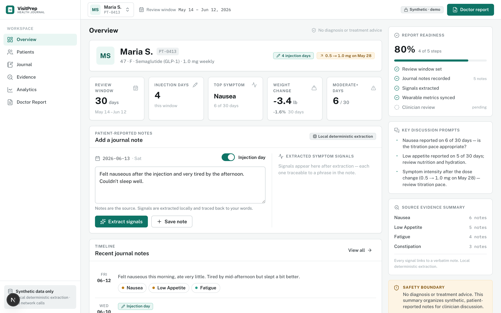
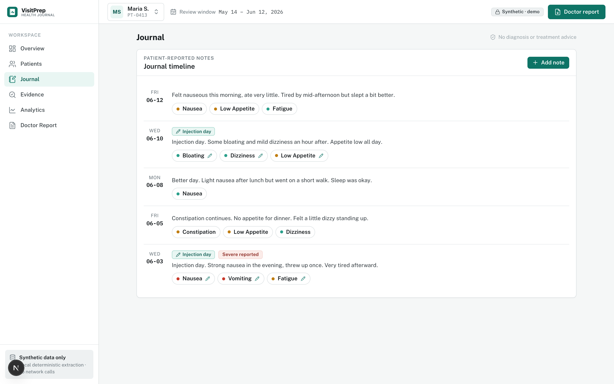
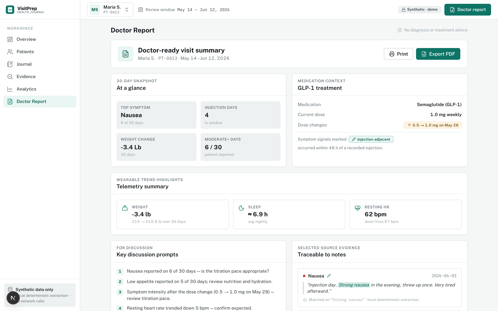
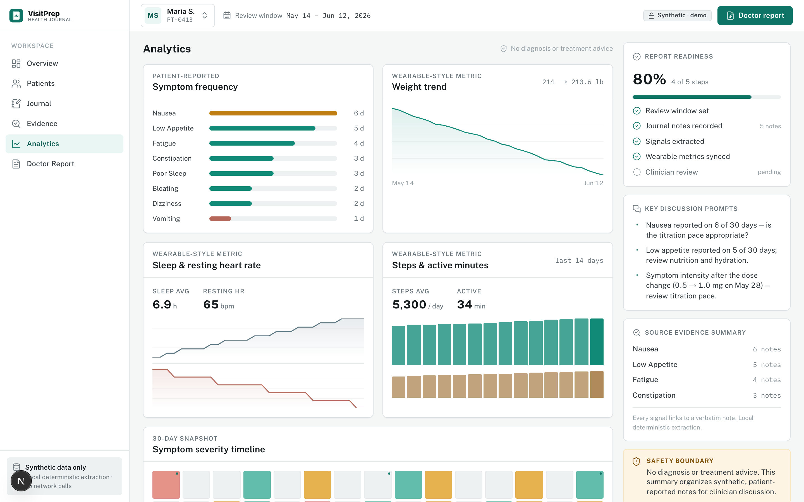

# VisitPrep — Clinical Natural Language Technology for Health Care

**Cotiviti Intern Assessment · Topic 1: Clinical Natural Language Technology (Past, Present & Future — NLP, OCR, Computer Vision, LLM, LMM)**

VisitPrep is a proof-of-concept web application that demonstrates the clinical-NLP value chain end to end:

```
Unstructured patient note  →  structured symptom signals  →  trend analytics  →  doctor-ready summary
```

It turns a patient's free-text daily health notes and wearable-style telemetry into **structured, source-grounded, auditable** clinical signals and a concise pre-visit summary a clinician can review. The initial use case is a patient tracking **GLP-1 / weight-loss injection** side effects (nausea, vomiting, fatigue, appetite, sleep, weight, resting heart rate, activity).

> **Design thesis:** In regulated healthcare, the winning pattern is *hybrid and provenance-first* — deterministic, auditable extraction where every downstream number can be traced back to a specific patient phrase, with neural methods layered in behind the same interfaces without losing the audit trail.

---

## Screenshots

### Overview — journal capture + live signal extraction
Patient-reported notes are the source; symptom signals are extracted locally and traced back to the exact phrase. KPI cards, report-readiness, discussion prompts, and a persistent safety boundary frame the workspace.



### Journal — per-note timeline with extracted signals
Each patient note is shown with the symptom signals extracted from it, color-coded by severity, plus injection-day and "severe reported" markers — making the raw evidence behind every downstream metric browsable at a glance.



### Doctor Report — source-grounded, doctor-ready summary
A 30-day snapshot, GLP-1 medication context with injection-adjacency, wearable telemetry, discussion prompts, and **selected source evidence with the matched phrase highlighted** — every claim is traceable to a note.



### Analytics — symptom frequency, severity & wearable trends
Symptom frequency, weight trend, sleep / resting-heart-rate, steps / active minutes, and a symptom-severity timeline — all computed deterministically from the extracted signals.



---

## Why this matters for Cotiviti

Roughly **80% of clinical data is unstructured** text. The same hybrid, provenance-first extraction demonstrated here maps directly onto Cotiviti's core lines of business:

- **Risk adjustment (HCC):** surface supported / unsupported diagnosis evidence from charts.
- **Payment integrity / clinical validation:** validate claims against the actual documentation at scale.
- **Quality measurement (HEDIS-style):** extract numerator/denominator evidence that structured claims miss.

Because every signal carries a visible source span, the outputs are **auditable and defensible** — the property black-box generative models struggle to provide. See the full write-up in the report under `deliverables/`.

---

## Architecture

Four layers, with the **auditable NLP kept fully separate from presentation**:

| Layer | Location | Responsibility |
|------|----------|----------------|
| **Data** | `src/lib/syntheticDataset.ts`, `src/types/health.ts` | Typed `JournalEntry` + `WearableMetrics`; synthetic JSON only (no PHI). Wearable data kept separate from journal text. |
| **NLP extraction** | `src/lib/nlp/` | Deterministic, rule-based, auditable: symptom dictionary, assertion/negation detection, severity phrases, temporal + injection context, evidence spans, confidence scores. |
| **Analytics** | `src/lib/analytics/` | Symptom frequency, category mix, severity distribution, injection-adjacent analysis, wearable trends. |
| **Report** | `src/lib/report/` | Template-based doctor summary built from computed data (never from live UI state), with safety disclaimer and traceable evidence. |

### NLP extraction in detail (`src/lib/nlp/`)

- **Dictionary:** 14 symptoms across 7 categories (GI, energy, mood, cardio, sleep, appetite, other) with weighted aliases.
- **Assertion detection:** `present` / `absent` / `uncertain` / `resolved`, negation- and hedge-aware.
- **Clause-aware negation:** *"No vomiting since breakfast, **but** I vomited after lunch"* correctly extracts vomiting as **present** — negation scope stops at clause boundaries (`but`, `however`, `,`, `;`).
- **Severity** phrase detection (mild / moderate / severe) with self-rating fallback.
- **Temporal + injection context** tagging (e.g., a symptom within 48h of an injection).
- **Evidence span + confidence** on every signal — provenance-first. `extractionMethod` is typed for `rule-based` today and `semantic-local` / `hybrid` later.

### Evaluation

A deterministic eval harness scores extraction against annotated synthetic data:

```bash
npm run nlp:evaluate
```

On the curated synthetic set (**150 entries / 156 signals**): Precision **1.00**, Recall **1.00**, F1 **1.00**, severity accuracy **0.94**, evidence-span coverage **1.00**, negation false positives **0**.

> **Honesty caveat:** these numbers are on a curated synthetic dataset the rules were tuned against. They demonstrate that the pipeline is *correct*, not that it generalizes to real-world charts.

---

## Safety boundaries

VisitPrep organizes, summarizes, and visualizes patient-reported data. It **does not** diagnose, determine causality, recommend treatment or medication changes, or perform emergency triage. Generated language is deliberately hedged — *"reported," "overlapped with," "may be useful to discuss"* — never *"caused by"* or *"diagnosed as."* All data in this repo is **synthetic**; there are **no external LLM/API calls** in the MVP.

---

## Tech stack

- **Next.js** (App Router) · **React** · **TypeScript**
- **Recharts** for data visualization
- **VisitPrep design system** — calm clinical SaaS: teal accent, cool-gray neutrals, Public Sans + IBM Plex Mono, no gradients/emoji (`design-system/`)
- Local JSON data · deterministic rule-based NLP · **no external AI APIs**

---

## Getting started

```bash
npm install
npm run dev          # http://localhost:3000
npm run nlp:evaluate # run the NLP evaluation harness
npm run build        # production build
```

---

## Repository layout

```
src/
  app/                  # Next.js entry + global styles
  components/           # VisitPrep workspace UI (overview, journal, analytics, doctor report)
  lib/
    nlp/                # deterministic clinical NLP extraction (+ evaluation target)
    analytics/          # symptom + wearable analytics
    report/             # doctor-ready summary generation
  types/                # explicit, typed data models
data/synthetic/         # synthetic patient journals (no PHI)
design-system/          # VisitPrep design tokens + component references
scripts/evaluate_nlp.ts # NLP evaluation harness
deliverables/           # assessment report (.docx) + slide deck (.pptx)
docs/screenshots/       # application screenshots (this README)
```

---

## Assessment deliverables

Located in `deliverables/`:

- **`VisitPrep_Clinical_NLP_Report.pdf`** — 2-page technical paper (two-column research format: abstract, introduction, background, system design, evaluation, limitations, references). LaTeX source in `report.tex`.
- **`VisitPrep_Clinical_NLP_Deck.pptx`** — 12-slide overview of the topic and this POC, styled with the VisitPrep design system.

_This POC is a demonstration prototype built for a healthcare-focused technical assessment. It is not a medical device and must not be used for clinical decision-making._
